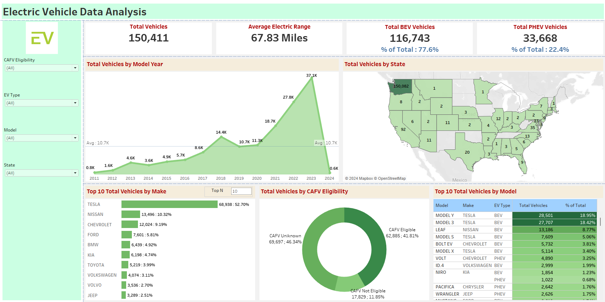

# Electric Vehicle Data Analysis Dashboard 🔌🚗

This interactive **Tableau dashboard** explores trends across **150,000+ electric vehicles (EVs)** in the U.S., focusing on vehicle types, models, efficiency, and adoption by state. Built to uncover actionable insights and visualize the rapid growth of EVs in recent years.

---

## 📊 Key Highlights

- **Total Vehicles Analyzed**: 150,411
  - **BEVs** (Battery Electric Vehicles): 77.6%
  - **PHEVs** (Plug-in Hybrid Electric Vehicles): 22.4%
- **Average Electric Range**: 67.83 miles
- **EV Growth Trends**:
  - Significant growth in 2023 with **37,100 vehicles** added
- **Top 10 EV Makes**:
  - **Tesla** dominates with 68,938 vehicles (52.7%), followed by **Nissan**, **Chevrolet**, and **Ford**
- **State-wise Distribution**:
  - **Washington (WA)** leads with 150,082 vehicles
- **CAFV Eligibility**:
  - 41.8% eligible for Clean Alternative Fuel Vehicle (CAFV) incentives
  - 46.3% unknown eligibility status

---

## 📌 Dashboard Visuals

- **📈 Vehicles by Year**: Tracks EV growth over time
- **🗺️ State-wise Distribution**: U.S. map showing EV penetration by region
- **🏎️ Top Makes & Models**: Highlights market leaders like Tesla Model Y and Model 3
- **🧾 CAFV Eligibility**: Pie chart breakdown to support policy and incentive analysis

---

## 🛠️ Tools & Skills Used

- **Tableau Public/Desktop** – for dashboard development
- **Data Cleaning & Preprocessing** – using Excel/Power Query
- **Calculated Fields & Filters** – for dynamic insights
- **Storytelling with Visuals** – clean layout, actionable KPIs

---

## 📁 Files

- `/Images/ev_dashboard_preview.png` – Dashboard image
- `README.md` – Project overview and documentation

---

## 📸 Dashboard Preview

---

## 📚 Data Source

The dataset contains real-world EV registration data across U.S. states. Sources may include government portals or open transportation data repositories. The data was cleaned, structured, and analyzed for visualization purposes.

---

## 💡 Insights & Use Cases

This dashboard can help:
- **Businesses**: Track EV market share and brand performance
- **Policymakers**: Understand regional adoption and incentive impact
- **Analysts**: Monitor trends and identify growth opportunities

---

## 👤 About the Creator

Hi, I’m **Bharat Kumar**, a Data Research Analyst with 6+ years of experience in **data visualization, dashboarding, and BI tools**. This dashboard was created as part of my hands-on Tableau portfolio to demonstrate real-world data storytelling.

> 🔗 [Connect with me on LinkedIn](https://www.linkedin.com/in/bharat-kumar-bh)

---

## ✅ Project Status

> 🚀 Completed  
> 💬 Open to suggestions for feature improvements  
> 📌 Showcased on GitHub & LinkedIn portfolio  

---

## 🔗 Related Projects

- [COVID-19 Publications Dashboard](https://github.com/bharat1271/covid19-publications-dashboard)
- [Road Accident Analysis Dashboard](https://github.com/bharat1271/road-accident-analysis-dashboard)

---

## ⭐ Support

If you found this helpful:
- Give the repo a ⭐
- Connect on LinkedIn to share feedback or collaborate
